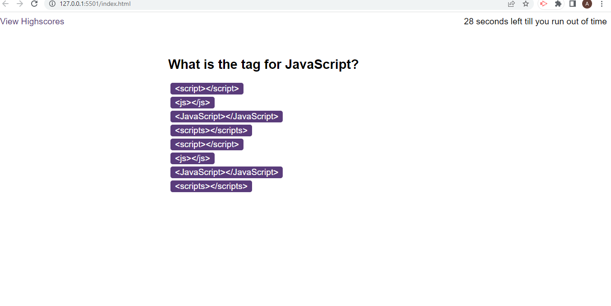

# Module 6 Challenge Web APIs: Code Quiz

## Your Task

As you proceed in your journey to becoming a front-end web developer, it’s likely that you’ll be asked to complete a coding assessment, perhaps as part of an interview process. A typical coding assessment is a combination of multiple-choice questions and interactive coding challenges. 

To help you become familiar with these tests and give you a chance to apply the skills from this module, this week’s challenge invites you to build a timed coding quiz with multiple-choice questions. This app will run in the browser, and will feature dynamically updated HTML and CSS powered by JavaScript code that you write. It will have a clean, polished, and responsive user interface. This week’s coursework has taught you all the skills you need to succeed in this challenge.
 

## User Story

```
AS A coding boot camp student
I WANT to take a timed quiz on JavaScript fundamentals that stores high scores
SO THAT I can gauge my progress compared to my peers
```

## Acceptance Criteria

Create a code quiz that contains the following requirements:

* A start button that when clicked a timer starts and the first question appears.
 
  * Questions contain buttons for each answer. - if statement 
  * 
  * When answer is clicked, the next question appears
  * 
  * If the answer clicked was incorrect then subtract time from the clock

* The quiz should end when all questions are answered or the timer reaches 0.

  * When the game ends, it should display their score and give the user the ability to save their initials and their score

## Progress with this task
The comments in each JavaScript file outlines what has been done and further developments I need to make
I had to alter the file structure as there were issue when the files were in different folders

## Deployed application Link


## Screenshot 

  

